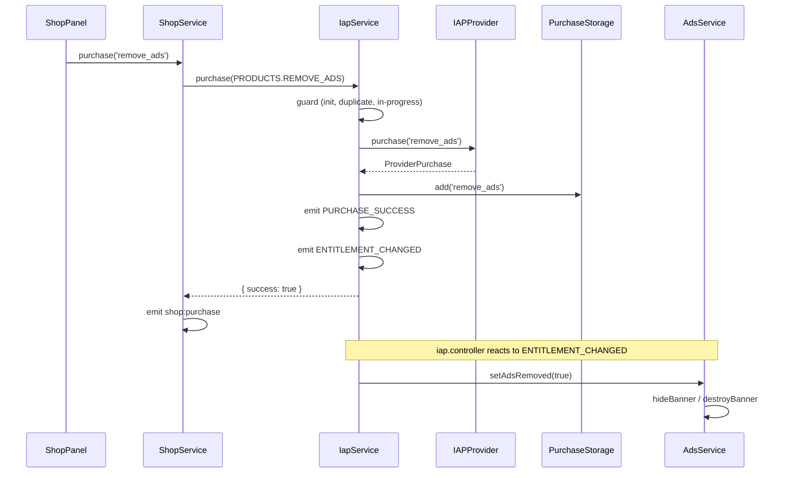
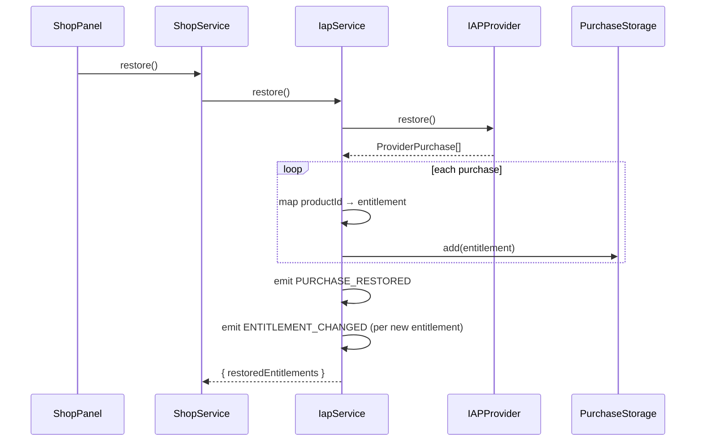

# In-App Purchase (IAP) Module

Client-side IAP for the game starter kit. First use case: **Remove Ads** (non-consumable). Designed for config-driven product expansion without changing service logic.

## Architecture

```
src/platform/modules/iap/
├── adapters/
│   ├── mock.adapter.ts          # Dev / web mock provider
│   ├── revenuecat.adapter.ts    # Native — @revenuecat/purchases-capacitor
│   └── index.ts                 # createIapProvider()
├── config/
│   └── iap.config.ts        # Product registry (PRODUCTS)
├── storage/
│   └── purchase.storage.ts  # Entitlement persistence (StorageService)
├── services/
│   └── iap.service.ts       # IapService — init, purchase, restore, has()
├── types/
│   └── iap.types.ts         # IAPProvider interface, result types
├── events/
│   └── iap.events.ts        # Event name constants + payloads
├── hooks/
│   └── use-entitlement.ts   # Reactive entitlement subscriptions
├── iap.controller.ts        # Wires entitlements → ads, restore → save
└── index.ts

src/platform/bootstrap/iap.ts  # registerIapProvider() — mirrors ads bootstrap
```

### Layers

| Layer | Responsibility |
| ----- | -------------- |
| **config** | Product registry — map store IDs → entitlements |
| **adapters** | Swappable providers (`IAPProvider` interface) |
| **storage** | Durable entitlement cache (Preferences / IndexedDB) |
| **service** | Business logic: init guard, purchase, restore, entitlement state |
| **controller** | Side effects: disable ads, trigger save on restore |
| **events** | Decouple Phaser UI from IAP internals |

### Ads integration

`bindIapController()` calls `ads.setAdsRemoved(true)` when `remove_ads` entitlement is active.

| Format | Blocked when remove_ads? |
| ------ | ------------------------ |
| banner | Yes |
| interstitial | Yes |
| app_open | Yes |
| rewarded | No |

Use `ads.canShow(format, placement)` for unified checks.

## API

```typescript
import { iap, PRODUCTS, IAP_EVENTS } from '@platform/modules/iap';

// Initialize (once, idempotent)
await iap.initialize();

// Purchase
const result = await iap.purchase(PRODUCTS.REMOVE_ADS);
// { success, cancelled, entitlement?, error? }

// Entitlement checks
iap.has('remove_ads');
iap.isPremium();

// Restore
await iap.restore();

// Events (Phaser)
eventBus.on(IAP_EVENTS.ENTITLEMENT_CHANGED, ({ entitlement, active }) => { ... });
```

## Purchase flow



## Restore flow



Empty restore (no prior purchases) returns `{ success: true, restoredEntitlements: [] }` — no crash.

## Adding a new product

1. Register in `config/iap.config.ts`:

```typescript
export const PRODUCTS = {
  REMOVE_ADS: { id: 'remove_ads', type: 'non_consumable', entitlement: 'remove_ads' },
  PREMIUM: { id: 'premium', type: 'non_consumable', entitlement: 'premium' },
} as const;
```

2. Add store / Play Console product with matching `id`.
3. Update provider adapter to return the product in `getProducts()`.
4. Add shop catalog entry (optional) or call `iap.purchase(PRODUCTS.PREMIUM)` from UI.
5. If the product unlocks a feature, subscribe to `ENTITLEMENT_CHANGED` in a controller.

No changes to `IapService.purchase()` logic required.

## Swapping providers

| Platform | Provider | When |
| -------- | -------- | ---- |
| Web / dev | `mock` | Default — no store account needed |
| Native | `revenuecat` | `VITE_IAP_PROVIDER=revenuecat` + API keys set |

`registerIapProvider()` in `bootstrap/iap.ts` picks the provider automatically.

## RevenueCat setup

### 1. Install (already in starter kit)

```bash
npm install @revenuecat/purchases-capacitor
npx cap sync
```

### 2. RevenueCat Dashboard

1. Create project → add **iOS** and **Android** apps (bundle ID / package name must match `capacitor.config.ts`)
2. Create **Entitlement** `remove_ads`
3. Create **Product** `remove_ads` (non-consumable) on App Store Connect + Google Play Console
4. Attach product to entitlement in RevenueCat
5. Copy **public API keys** (Android + iOS)

### 3. Environment

```env
VITE_IAP_ENABLED=true
VITE_IAP_PROVIDER=revenuecat
VITE_REVENUECAT_ANDROID_API_KEY=goog_xxxxxxxx
VITE_REVENUECAT_IOS_API_KEY=appl_xxxxxxxx
```

### 4. Native build

```bash
npm run build:android   # or build:ios
```

RevenueCat only runs on native (`Capacitor.isNativePlatform()`). Web dev always falls back to mock.

### 5. Entitlement mapping

RevenueCat entitlement identifier **must match** `PRODUCTS.*.entitlement` in `iap.config.ts`:

```typescript
REMOVE_ADS: { id: 'remove_ads', entitlement: 'remove_ads' }
//                              ↑ RC entitlement ID   ↑ store product ID
```

On init, `RevenueCatAdapter.fetchEntitlements()` reads `CustomerInfo.entitlements.active` and syncs to local storage.

### Custom provider

Implement `IAPProvider` and register in `bootstrap/iap.ts`:

```typescript
import type { IAPProvider } from '@platform/modules/iap';

class MyAdapter implements IAPProvider { /* ... */ }

iap.setProvider(new MyAdapter());
```

## Migration guide (from old `core/iap`)

| Old | New |
| --- | --- |
| `@platform/core/iap` | `@platform/modules/iap` |
| `iap.init()` | `iap.initialize()` |
| `iap.purchase(productId: string)` | `iap.purchase(PRODUCTS.REMOVE_ADS)` |
| `iap:purchase` event | `iap:purchase:success` / `iap:purchase:failed` |
| Mock products in `IapService.ts` | `adapters/mock.adapter.ts` + `config/iap.config.ts` |
| Server `/iap/verify` | Removed (client-only) |
| `coins_pack` IAP item | Removed (consumables not implemented yet) |

### Bootstrap change

`App.ts` now calls `registerIapProvider()` before `iap.initialize()` and `bindIapController(events)`.

## Files changed in this refactor

### Created

- `src/platform/modules/iap/**` (full module)
- `src/platform/bootstrap/iap.ts`
- `docs/IAP.md` (this file)

### Modified

- `src/platform/bootstrap/App.ts`
- `src/platform/core/services/index.ts`
- `src/platform/core/index.ts`
- `src/platform/core/advertising/AdsService.ts`
- `src/platform/core/events/types.ts`
- `src/platform/modules/shop/shop.service.ts`
- `src/platform/modules/shop/catalog.json`
- `src/platform/modules/index.ts`
- `src/platform/ui/shop/ShopPanel.ts`
- `src/platform/modules/i18n/locales/en.json`
- `src/platform/modules/i18n/locales/vi.json`
- `eslint.config.js`

### Deleted

- `src/platform/core/iap/IapService.ts`
- `src/platform/core/iap/types.ts`
- `src/platform/core/iap/index.ts`

## Test checklist

- [ ] `VITE_IAP_ENABLED=true` in `.env`
- [ ] App boots without IAP errors (`iap.initialize()` in console)
- [ ] Shop shows **Remove Ads** item
- [ ] Purchase succeeds (mock ~800ms delay) → toast success
- [ ] Banner / interstitial stop showing immediately after purchase
- [ ] Rewarded ads still work after remove_ads
- [ ] Restart app → ads still blocked (entitlements persisted)
- [ ] **Restore Purchases** with no prior purchase → info toast, no crash
- [ ] Purchase remove_ads → restore → shows "no new purchases" or 0 restored
- [ ] Duplicate purchase attempt → fails gracefully ("Already owned")
- [ ] `iap:entitlement:changed` fires on purchase and restore
- [ ] Shop row shows "Owned" after purchase

### Mock restore testing

In dev tools console (after a purchase in same session), mock adapter keeps in-memory purchases. After app restart, restore returns empty unless entitlements were persisted — persisted entitlements load on init regardless of provider restore.

## Environment

```env
VITE_IAP_ENABLED=true
VITE_IAP_PROVIDER=revenuecat   # mock on web; revenuecat on native
VITE_REVENUECAT_ANDROID_API_KEY=goog_xxx
VITE_REVENUECAT_IOS_API_KEY=appl_xxx
```

When `false`, `iap.purchase()` returns `{ success: false, error: 'IAP not available' }`.
