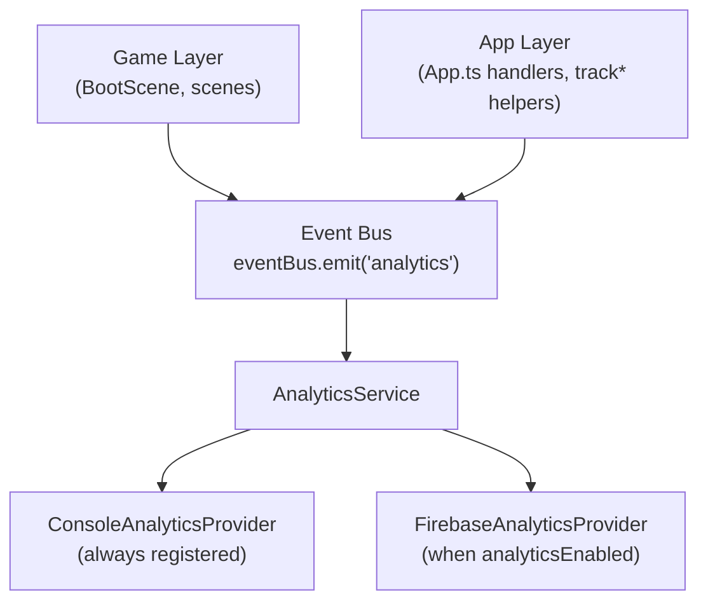
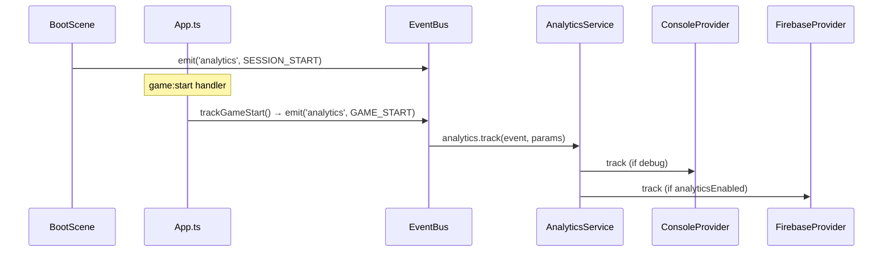

# Analytics

Production-grade, provider-based analytics for the game starter kit. The **game layer** never imports `@platform/core/analytics` — ESLint enforces this. Events reach providers through the typed event bus.

## Architecture



### Layers

| Layer | Responsibility |
|-------|----------------|
| **Game** | May emit `analytics` events via `eventBus` — no provider knowledge |
| **App** | Wires platform events to `track*()` helpers; forwards `analytics` / `analytics:track` to the service |
| **Event Bus** | Single entry point: `eventBus.emit('analytics', { event, params })` |
| **AnalyticsService** | Fans out to registered providers; skips non-console providers when `analyticsEnabled` is false |
| **Providers** | Console (debug logging) and Firebase (GA4) |

### Provider flow

Two paths converge on the same bus → service → providers pipeline:



`App.ts` registers forwarders that connect the bus to the service:

```ts
eventBus.on('analytics', ({ event, params }) => analytics.track(event, params));
eventBus.on('analytics:track', ({ event, params }) => analytics.track(event, params)); // legacy alias
```

Platform `track*()` helpers in `@platform/core/analytics/events` also call `eventBus.emit('analytics', ...)`, so they follow the same path.

## Event registry

Constants are defined in `src/platform/core/analytics/types.ts` and re-exported from `@platform/core/events`:

```ts
import { eventBus, AnalyticsEvents } from '@platform/core/events';

eventBus.emit('analytics', {
  event: AnalyticsEvents.LEVEL_START,
  params: { level: 3 },
});
```

| Event | Constant | Wired in codebase | Source |
|-------|----------|-------------------|--------|
| Session start | `SESSION_START` | Yes | `BootScene` → `eventBus.emit('analytics', …)` |
| Session end | `SESSION_END` | Yes | `App.bindLifecycle()` on `document.hidden`; `App.destroy()` |
| Game start | `GAME_START` | Yes | `App.ts` on `game:start` → `trackGameStart()` |
| Game over | `GAME_OVER` | Yes | `App.ts` on `game:over` → `trackGameOver()` |
| Level complete | `LEVEL_COMPLETE` | Yes | `App.ts` on `level:complete` → `trackLevelComplete()` |
| Purchase | `PURCHASE` | Yes | `App.ts` on `shop:purchase` → `trackPurchase()` |
| Ad reward | `AD_REWARD` | Yes | `App.ts` on `ad:reward` → `trackAdReward()` |
| Daily claim | `DAILY_CLAIM` | Yes | `App.ts` on successful `daily:claim:request` → `trackDailyClaim()` |
| Mission complete | `MISSION_COMPLETE` | Yes | `App.ts` on `mission:complete` → `trackMissionComplete()` |
| Level start | `LEVEL_START` | Helper only | `trackLevelStart()` exported — call from gameplay or wire in `App.ts` |
| Shop open | `SHOP_OPEN` | Helper only | `trackShopOpen()` exported — call when opening shop UI |

## Emitting events from gameplay

**Do not** import `@platform/core/analytics` from `src/game/`. ESLint rule `no-restricted-imports` in `eslint.config.js` blocks it.

```ts
import { eventBus, AnalyticsEvents } from '@platform/core/events';

// Custom gameplay event — forwarded by App.ts listeners to analytics.track()
eventBus.emit('analytics', {
  event: AnalyticsEvents.LEVEL_START,
  params: { level: 3 },
});
```

Prefer emitting **platform events** (`game:start`, `level:complete`, …) and letting `App.ts` call the matching `track*()` helper when a handler already exists.

### Platform helpers

`src/platform/core/analytics/events.ts` exports typed helpers used by `App.ts`:

| Helper | Event constant |
|--------|----------------|
| `trackSessionStart` | `SESSION_START` |
| `trackSessionEnd` | `SESSION_END` |
| `trackGameStart` | `GAME_START` |
| `trackGameOver` | `GAME_OVER` |
| `trackLevelStart` | `LEVEL_START` |
| `trackLevelComplete` | `LEVEL_COMPLETE` |
| `trackPurchase` | `PURCHASE` |
| `trackAdReward` | `AD_REWARD` |
| `trackShopOpen` | `SHOP_OPEN` |
| `trackDailyClaim` | `DAILY_CLAIM` |
| `trackMissionComplete` | `MISSION_COMPLETE` |

Each helper calls `eventBus.emit('analytics', { event, params })` internally.

> **Note:** `BootScene` emits `SESSION_START` directly via the bus instead of calling `trackSessionStart()`. Both approaches are equivalent.

## Configuration

Runtime config lives in `src/platform/core/config/index.ts`. Firebase credentials come from env vars:

| Variable | Description |
|----------|-------------|
| `VITE_APP_ENV` | `dev` \| `staging` \| `production` — sets `analyticsEnabled` via `ENV_CONFIGS` |
| `VITE_FIREBASE_API_KEY` | Firebase web API key |
| `VITE_FIREBASE_AUTH_DOMAIN` | Firebase auth domain |
| `VITE_FIREBASE_PROJECT_ID` | Firebase project ID |
| `VITE_FIREBASE_APP_ID` | Firebase app ID |
| `VITE_FIREBASE_MEASUREMENT_ID` | GA4 measurement ID |

| Environment | `analyticsEnabled` | `debug` | Firebase provider registered | Console logs events |
|-------------|-------------------|---------|------------------------------|---------------------|
| dev | `false` | `true` | No | Yes (when events fire) |
| staging | `true` | `true` | Yes | Yes |
| production | `true` | `false` | Yes | No |

**Console provider** is always registered. It only writes to the console when `getConfig().debug === true`. When `analyticsEnabled` is false, `AnalyticsService` still forwards events to the console provider but skips Firebase.

**Firebase provider** is registered when `analyticsEnabled` is true. If Firebase env vars are missing, the provider logs a warning and no-ops at runtime.

Copy `.env.example` to `.env` and fill Firebase values for staging/production.

## Firebase setup

1. Create a Firebase project at [console.firebase.google.com](https://console.firebase.google.com).
2. Add a **Web** app and copy the config object.
3. Enable **Google Analytics** for the project.
4. Set env vars in `.env`:

```env
VITE_APP_ENV=staging
VITE_FIREBASE_API_KEY=your-api-key
VITE_FIREBASE_AUTH_DOMAIN=your-project.firebaseapp.com
VITE_FIREBASE_PROJECT_ID=your-project-id
VITE_FIREBASE_APP_ID=1:123456789:web:abc123
VITE_FIREBASE_MEASUREMENT_ID=G-XXXXXXXXXX
```

5. Run the app and open **Firebase Console → Analytics → DebugView**.
6. For web debug mode, install the [Google Analytics Debugger](https://chrome.google.com/webstore/detail/google-analytics-debugger/jnkmfdileelhofjcijamephohjechhna) extension or add `debug_mode: true` to events during development.

## Provider registration

Registration runs in `registerAnalyticsProviders()` (`src/platform/bootstrap/analytics.ts`), called at the start of `App.init()`:

```ts
analytics.registerProvider(new ConsoleAnalyticsProvider());

if (getConfig().analyticsEnabled) {
  analytics.registerProvider(new FirebaseAnalyticsProvider());
}
```

## Adding a new provider

1. Create `src/platform/core/analytics/providers/MyProvider.ts`:

```ts
import type { AnalyticsEvent, AnalyticsParams, IAnalyticsProvider } from '../types';

export class MyAnalyticsProvider implements IAnalyticsProvider {
  readonly name = 'my-provider';

  async init(): Promise<void> { /* ... */ }
  track(event: AnalyticsEvent, params?: AnalyticsParams): void { /* ... */ }
  setUserId(userId: string): void { /* ... */ }
  setUserProperty(key: string, value: string): void { /* ... */ }
  async flush(): Promise<void> { /* ... */ }
}
```

2. Register in `src/platform/bootstrap/analytics.ts`.
3. Export from `src/platform/core/analytics/index.ts` if needed publicly.

Implement `reset?()` and `shutdown?()` for providers that hold SDK state.

## Lifecycle

| Method | When called |
|--------|-------------|
| `init()` | `App.init()` — after providers are registered |
| `setUserId()` / `setUserProperty()` | `App.init()` — after store user id is available |
| `flush()` | App backgrounded (`document.hidden`) |
| `shutdown()` | `App.destroy()` |
| `reset()` | Optional — user logout (not wired by default) |

`AnalyticsService` safely calls optional `reset` / `shutdown` on providers — missing implementations are skipped.

## User identity

`userId` is **not** injected into event params. Set it once via the service API during bootstrap:

```ts
analytics.setUserId(userId);
analytics.setUserProperty('game_id', gameId);
```

Firebase receives `setUserId` and `setUserProperties` natively.

## Disabling analytics

Set `VITE_APP_ENV=dev`. Firebase is not registered; the console provider still logs in debug mode when events are emitted.

## File structure

```text
src/platform/core/analytics/
├── AnalyticsService.ts
├── types.ts                 # AnalyticsEvents constants
├── events.ts                # trackGameStart, trackPurchase, …
├── index.ts
└── providers/
    ├── ConsoleAnalyticsProvider.ts
    └── FirebaseAnalyticsProvider.ts

src/platform/bootstrap/
├── analytics.ts             # registerAnalyticsProviders()
└── App.ts                   # event → track*() wiring, bus forwarders

src/platform/core/events/
├── EventBus.ts
├── types.ts                 # 'analytics' and 'analytics:track' event typing
└── index.ts                 # re-exports AnalyticsEvents

src/game/scenes/
└── BootScene.ts             # emits SESSION_START via event bus
```

## Migration from legacy API

| Before | After |
|--------|-------|
| `analytics.track('game_start')` directly from game | `eventBus.emit('analytics', { event: AnalyticsEvents.GAME_START })` |
| `analytics:track` event | `analytics` event (`analytics:track` still forwarded in `App.ts`) |
| `userId` in event params | `analytics.setUserId()` at bootstrap |
