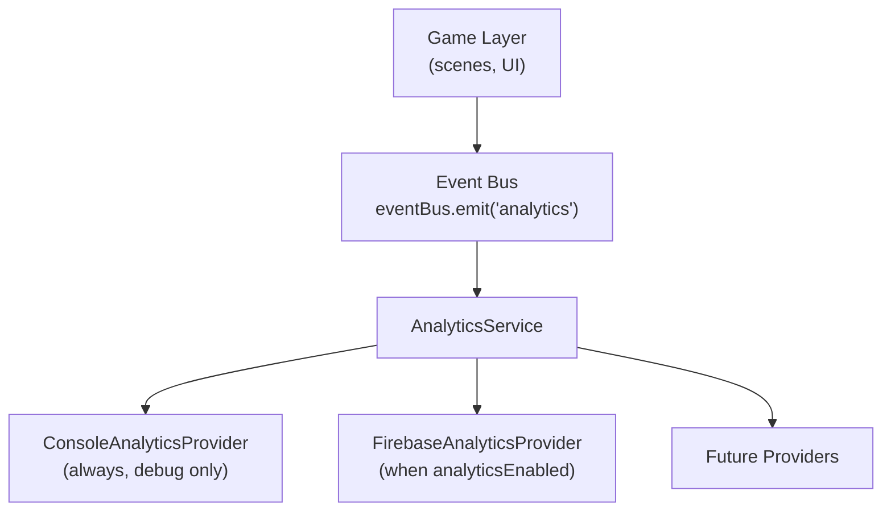
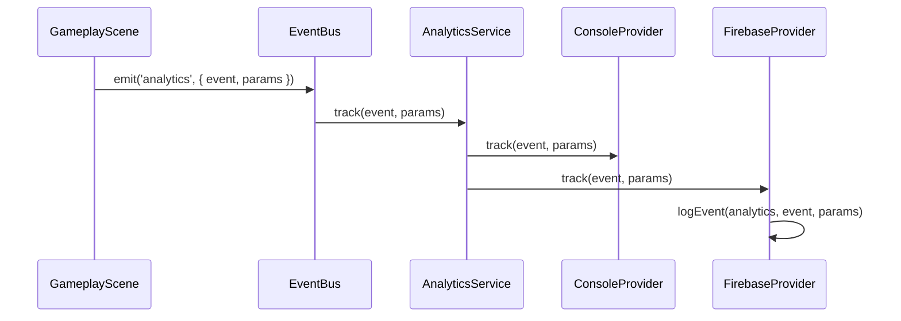

# Analytics

Production-grade, provider-based analytics for the game starter kit. Gameplay never imports the analytics service directly — events flow through the typed event bus.

## Architecture



### Layers

| Layer | Responsibility |
|-------|----------------|
| **Game** | Emits `analytics` events via `eventBus` — no provider knowledge |
| **Event Bus** | Decouples gameplay from platform services |
| **AnalyticsService** | Fans out to registered providers, handles lifecycle |
| **Providers** | Send data to Firebase, console, or third-party SDKs |

### Provider flow



## Event registry

All events are defined in `src/platform/core/analytics/types.ts`:

```ts
import { AnalyticsEvents } from '@platform/core/events';

eventBus.emit('analytics', {
  event: AnalyticsEvents.GAME_START,
  params: { mode: 'normal' },
});
```

| Event | Constant | Typical source |
|-------|----------|----------------|
| Session start | `SESSION_START` | Boot scene |
| Session end | `SESSION_END` | App lifecycle (background) |
| Game start | `GAME_START` | `game:start` platform handler |
| Game over | `GAME_OVER` | `game:over` platform handler |
| Level start | `LEVEL_START` | Gameplay (via event bus) |
| Level complete | `LEVEL_COMPLETE` | `level:complete` handler |
| Purchase | `PURCHASE` | Shop |
| Ad reward | `AD_REWARD` | Ads module |
| Shop open | `SHOP_OPEN` | UI |
| Daily claim | `DAILY_CLAIM` | Daily rewards |
| Mission complete | `MISSION_COMPLETE` | Missions |

## Emitting events from gameplay

**Do not** import `@platform/core/analytics` from `src/game/`. ESLint enforces this.

```ts
import { eventBus, AnalyticsEvents } from '@platform/core/events';

// In a Phaser scene
eventBus.emit('analytics', {
  event: AnalyticsEvents.LEVEL_START,
  params: { level: 3 },
});
```

### Platform helpers

The App layer uses typed helpers from `@platform/core/analytics/events` to avoid string literals:

```ts
import { trackGameStart, trackPurchase } from '@platform/core/analytics/events';

trackGameStart({ mode: 'arcade' });
trackPurchase({ itemId: 'coins_100', price: 0.99 });
```

Helpers internally call `eventBus.emit('analytics', ...)`, so they follow the same bus → service → provider path.

## Configuration

Environment config lives in `src/platform/core/config/index.ts`:

| Variable | Description |
|----------|-------------|
| `VITE_APP_ENV` | `dev` \| `staging` \| `production` — controls `analyticsEnabled` via `ENV_CONFIGS` |
| `VITE_FIREBASE_API_KEY` | Firebase web API key |
| `VITE_FIREBASE_AUTH_DOMAIN` | Firebase auth domain |
| `VITE_FIREBASE_PROJECT_ID` | Firebase project ID |
| `VITE_FIREBASE_APP_ID` | Firebase app ID |
| `VITE_FIREBASE_MEASUREMENT_ID` | GA4 measurement ID |

| Environment | `analyticsEnabled` default | Firebase |
|-------------|---------------------------|----------|
| dev | `false` | Not registered |
| staging | `true` | Registered when config present |
| production | `true` | Registered when config present |

**Console provider** is always registered and logs in debug mode regardless of `analyticsEnabled`.

Copy `.env.example` to `.env` and fill Firebase values for staging/production.

## Firebase setup

1. Create a Firebase project at [console.firebase.google.com](https://console.firebase.google.com).
2. Add a **Web** app and copy the config object.
3. Enable **Google Analytics** for the project.
4. Set env vars in `.env`:

```env
VITE_APP_ENV=staging
VITE_FIREBASE_API_KEY=your-api-key
VITE_FIREBASE_AUTH_DOMAIN=your-project.firebaseapp.com
VITE_FIREBASE_PROJECT_ID=your-project-id
VITE_FIREBASE_APP_ID=1:123456789:web:abc123
VITE_FIREBASE_MEASUREMENT_ID=G-XXXXXXXXXX
```

5. Run the app and open **Firebase Console → Analytics → DebugView**.
6. For web debug mode, install the [Google Analytics Debugger](https://chrome.google.com/webstore/detail/google-analytics-debugger/jnkmfdileelhofjcijamephohjechhna) extension or add `debug_mode: true` to events during development.

## Provider registration

Registration happens in `src/platform/bootstrap/analytics.ts` during `App.init()`:

```ts
analytics.registerProvider(new ConsoleAnalyticsProvider());

if (getConfig().analyticsEnabled) {
  analytics.registerProvider(new FirebaseAnalyticsProvider());
}
```

## Adding a new provider

1. Create `src/platform/core/analytics/providers/MyProvider.ts`:

```ts
import type { AnalyticsEvent, AnalyticsParams, IAnalyticsProvider } from '../types';

export class MyAnalyticsProvider implements IAnalyticsProvider {
  readonly name = 'my-provider';

  async init(): Promise<void> { /* ... */ }
  track(event: AnalyticsEvent, params?: AnalyticsParams): void { /* ... */ }
  setUserId(userId: string): void { /* ... */ }
  setUserProperty(key: string, value: string): void { /* ... */ }
  async flush(): Promise<void> { /* ... */ }
}
```

2. Register in `src/platform/bootstrap/analytics.ts`.
3. Export from `src/platform/core/analytics/index.ts` if needed publicly.

Implement `reset?()` and `shutdown?()` for providers that hold SDK state.

## Lifecycle

| Method | When called |
|--------|-------------|
| `init()` | App bootstrap |
| `flush()` | App backgrounded |
| `reset()` | User logout (optional) |
| `shutdown()` | App destroy |

`AnalyticsService` safely calls optional `reset` / `shutdown` on providers — missing implementations are skipped.

## User identity

`userId` is **not** injected into event params. Set it once via the provider API:

```ts
analytics.setUserId(userId);
analytics.setUserProperty('game_id', gameId);
```

Firebase receives `setUserId` and `setUserProperties` natively.

## Disabling analytics

Use the `dev` environment (`VITE_APP_ENV=dev`). Firebase is not registered; console still logs in debug mode when events are emitted.

## File structure

```text
src/platform/core/analytics/
├── AnalyticsService.ts
├── types.ts
├── events.ts              # Platform helpers (trackGameStart, etc.)
├── index.ts
└── providers/
    ├── ConsoleAnalyticsProvider.ts
    └── FirebaseAnalyticsProvider.ts

src/platform/bootstrap/
└── analytics.ts           # Provider registration

src/platform/core/events/
├── EventBus.ts            # emit / on / off / once
└── types.ts               # 'analytics' event typing
```

## Migration from legacy API

| Before | After |
|--------|-------|
| `analytics.track('game_start')` | `eventBus.emit('analytics', { event: AnalyticsEvents.GAME_START })` |
| `analytics:track` event | `analytics` event (legacy alias still works) |
| `userId` in event params | `analytics.setUserId()` |
