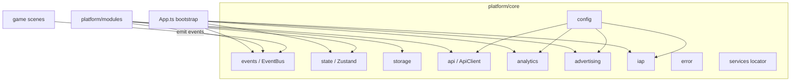

# Core Layer (`src/platform/core`)

`src/platform/core` là tầng **hạ tầng (infrastructure layer)** của platform — nơi chứa các service dùng chung, không gắn UI hay business logic game cụ thể.

Các module trong `src/platform/modules` và `bootstrap` đều dựa trên lớp này.

---

# Tổng quan cấu trúc

```text
src/platform/core/
├── index.ts          # Barrel export toàn bộ core
├── services/         # Service locator — điểm truy cập tập trung
├── config/           # Runtime config theo môi trường
├── events/           # Event bus typed
├── state/            # Global state (Zustand)
├── storage/          # Lưu trữ local
├── api/              # HTTP client
├── analytics/        # Tracking events
├── advertising/      # Quảng cáo
├── iap/              # In-app purchase
├── error/            # Logging & error handling
└── utils/            # Tiện ích chung
```

---

# `index.ts`

Re-export public API của toàn bộ core.

Thay vì:

```ts
import { eventBus } from '@platform/core/events'
```

Sử dụng:

```ts
import { eventBus } from '@platform/core'
```

---

# `services/` — Service Locator

Điểm truy cập tập trung cho các infrastructure service.

## Files

| File       | Vai trò                                                                  |
| ---------- | ------------------------------------------------------------------------ |
| `index.ts` | Object `services` gom: ads, iap, storage, analytics, api, events, config |

## Mục tiêu

* Tránh import rải rác
* Tập trung quản lý dependency
* Hỗ trợ cross-cutting infrastructure

Ví dụ:

```ts
services.analytics.track(...)
services.storage.save(...)
services.api.get('/save')
services.api.post('/save', data)
```

---

# `config/` — Cấu hình Runtime

Quản lý cấu hình theo môi trường.

## Files

| File       | Vai trò                                   |
| ---------- | ----------------------------------------- |
| `index.ts` | RuntimeConfig, preset env, config helpers |

## RuntimeConfig

Bao gồm:

* `apiUrl`
* `gameId`
* flags: `adsEnabled`, `iapEnabled`, `analyticsEnabled`
* Firebase config

## API

```ts
getConfig()
setConfig()
createConfig()
getEnvironment()
```

## Nguyên tắc

Mọi service đọc config từ đây để bật / tắt tính năng theo môi trường.

---

# `events/` — Giao tiếp Decoupled

Cho phép game và platform giao tiếp mà không phụ thuộc trực tiếp.

## Files

| File          | Vai trò                   |
| ------------- | ------------------------- |
| `EventBus.ts` | Bus sự kiện typed         |
| `types.ts`    | PlatformEventMap          |
| `index.ts`    | Export singleton eventBus |

## API

```ts
on()
off()
once()
emit()
clear()
```

## Ví dụ luồng

```text
Game
 ↓ emit
game:start
coin:add
score:update

Platform
 ↓ subscribe
analytics
save
leaderboard
```

Game không cần biết analytics, save hay leaderboard hoạt động như thế nào.

---

# `state/` — Global State

Nguồn sự thật duy nhất (**single source of truth**) cho dữ liệu người chơi trên client.

## Files

| File       | Vai trò                     |
| ---------- | --------------------------- |
| `store.ts` | Zustand vanilla store       |
| `types.ts` | State shape + DEFAULT_STATE |
| `index.ts` | Export usePlatformStore     |

## Quản lý dữ liệu

* user
* currency
* inventory
* progress
* settings
* missions
* daily rewards
* leaderboard

---

# `storage/` — Lưu trữ Local

Facade quản lý nhiều storage provider.

## Files

| File                  | Vai trò                                 |
| --------------------- | --------------------------------------- |
| `StorageService.ts`   | API save / load / remove / clear / keys |
| `LocalStorage.ts`     | Provider localStorage                   |
| `IndexedDBStorage.ts` | Provider IndexedDB                      |
| `MemoryStorage.ts`    | In-memory storage                       |
| `types.ts`            | Interface StorageProvider               |
| `index.ts`            | Export singleton storage                |

## Vai trò provider

### LocalStorage

Dữ liệu nhỏ, đơn giản.

### IndexedDB

Dữ liệu lớn hơn.

### Memory

Test hoặc fallback.

---

# `api/` — HTTP Client

REST client dùng chung cho toàn hệ thống.

## Files

| File           | Vai trò                     |
| -------------- | --------------------------- |
| `ApiClient.ts` | HTTP client                 |
| `types.ts`     | Response, Error, Interfaces |
| `index.ts`     | Export singleton apiClient  |

## Tính năng

* `get()` / `post()` / `put()` / `delete()`
* timeout, retry
* auth token
* request / response / error interceptors

## Được dùng bởi

* save sync
* leaderboard
* IAP verify
* các API khác

---

# `analytics/` — Theo dõi hành vi

Thu thập và gửi dữ liệu phân tích.

## Files

| File                                     | Vai trò                    |
| ---------------------------------------- | -------------------------- |
| `AnalyticsService.ts`                    | Quản lý providers          |
| `events.ts`                              | Helper tracking            |
| `types.ts`                               | Analytics contracts        |
| `providers/ConsoleAnalyticsProvider.ts`  | Console logging            |
| `providers/FirebaseAnalyticsProvider.ts` | Firebase tracking          |
| `index.ts`                               | Export singleton analytics |

## API

```ts
track()
setUserId()
setUserProperty()
flush()
reset()
shutdown()
```

## Helper events (`events.ts`)

```ts
trackSessionStart()
trackSessionEnd()
trackGameStart()
trackGameOver()
trackLevelStart()
trackLevelComplete()
trackPurchase()
trackAdReward()
trackShopOpen()
trackDailyClaim()
trackMissionComplete()
```

Các helper này emit sự kiện `analytics` qua `EventBus`; `App.ts` forward sang `analytics.track()`.

---

# `advertising/` — Quảng cáo

Facade quản lý hệ thống quảng cáo.

## Files

| File            | Vai trò                      |
| --------------- | ---------------------------- |
| `AdsService.ts` | Quản lý ad lifecycle         |
| `types.ts`      | Ad contracts                 |
| `index.ts`      | Export ads + MockAdsProvider |

## Hỗ trợ

* rewarded
* interstitial
* banner

## Theo môi trường

Bật / tắt bằng config.

## Hiện trạng

* `MockAdsProvider` được gắn sẵn trong `advertising/index.ts`
* `ads.init()` chỉ chạy khi `adsEnabled === true` (mặc định `dev` là `false`)
* Production: thay provider thật (AdMob, Unity Ads…) qua `ads.setProvider()`

---

# `iap/` — In-App Purchase

Facade xử lý thanh toán trong ứng dụng.

## Files

| File            | Vai trò                                |
| --------------- | -------------------------------------- |
| `IapService.ts` | Mua hàng và verify                     |
| `types.ts`      | IAP contracts                          |
| `index.ts`      | Export singleton iap + MockIapProvider |

## Chức năng

* `purchase()` — kiểm tra `iapEnabled`; mặc định dùng `MockIapProvider` nếu chưa `setProvider()`
* `restore()`
* Verify receipt qua `POST /iap/verify` (fallback verify local nếu API lỗi)

## Models

```ts
IapProduct
IapPurchase
IIapProvider
IapVerifyResult
```

## Production

Kết nối:

* StoreKit
* Google Play

---

# `error/` — Logging & Error Handling

Xử lý lỗi tập trung.

## Files

| File       | Vai trò                 |
| ---------- | ----------------------- |
| `index.ts` | Logger + Error handlers |

## Bao gồm

* Logger (theo env)
* ErrorBoundary
* reportCrash()
* setupGlobalErrorHandlers()

## Theo dõi

```text
window.error
unhandledrejection
```

Có thể gửi crash report qua reporter đã đăng ký.

---

# `utils/` — Tiện ích chung

Các helper không phụ thuộc platform.

## Files

| File       | Vai trò          |
| ---------- | ---------------- |
| `index.ts` | Export utilities |

## Bao gồm

```ts
ObjectPool
debounce
throttle
generateId
clamp
formatNumber
wait
AssetCache
```

Dùng chung cho:

* game
* platform

---

# Quan hệ giữa các phần



---

# So sánh các tầng

| Layer       | Vai trò                                                          |
| ----------- | ---------------------------------------------------------------- |
| `core`      | Hạ tầng thuần: config, state, storage, HTTP, ads, analytics, IAP |
| `bootstrap` | Gắn core + modules và khởi động Phaser                           |
| `modules`   | Business logic: save, missions, leaderboard, daily rewards, shop, settings, i18n |

---

# Quy tắc Import

Game nên ưu tiên dùng:

* `eventBus`
* helper analytics

Tránh:

* import trực tiếp `App`
* truy cập service nội bộ của module nếu không thật sự cần

Mục tiêu là giữ kiến trúc **decoupled** và dễ mở rộng.
