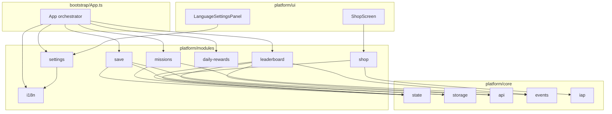

# Modules Layer (`src/platform/modules`)

`src/platform/modules` là tầng **business logic** của platform — nơi chứa các tính năng sản phẩm cụ thể.

Các module dựa trên `core` (state, storage, api, events, iap...) và được `bootstrap/App.ts` khởi tạo cũng như wire sự kiện.

---

# Tổng quan cấu trúc

```text
src/platform/modules/
├── index.ts              # Barrel export
├── save/                 # Lưu / đồng bộ tiến trình
├── settings/             # Cài đặt người chơi
├── i18n/                 # Đa ngôn ngữ
├── missions/             # Nhiệm vụ
├── leaderboard/          # Bảng xếp hạng
├── daily-rewards/        # Phần thưởng hàng ngày
└── shop/                 # Cửa hàng in-game
```

---

# `index.ts`

Re-export public API của toàn bộ modules.

## Exports

```ts
saveService
settings
missions
leaderboard
dailyRewards
shop
i18n
t
```

### Types

```ts
SupportedLanguage
```

---

# `save/` — Lưu & Đồng bộ tiến trình

Quản lý persist và đồng bộ dữ liệu người chơi.

## Files

| File              | Vai trò       |
| ----------------- | ------------- |
| `save.service.ts` | `SaveService` |

## Chức năng chính

### `saveLocal()`

Ghi state vào IndexedDB.

Bao gồm:

* user
* currency
* inventory
* progress
* settings
* missions
* dailyRewards

> `leaderboard` được cache riêng bởi `leaderboard.service`, không nằm trong payload save.

---

### `loadLocal()`

Hydrate dữ liệu vào:

```ts
usePlatformStore
```

---

### `saveCloud()` / `loadCloud()`

Đồng bộ qua API:

```text
POST /save
GET /save
```

---

### `sync()`

Merge local và cloud.

Nguyên tắc:

```text
Ưu tiên dữ liệu có timestamp mới hơn
```

---

### Offline fallback

Nếu cloud lỗi:

```text
Vẫn lưu local bình thường
```

## Được gọi từ

* `App.ts`
* `game:over`
* thay đổi settings
* app pause
* event `save:sync`

---

# `settings/` — Cài đặt người chơi

Facade quản lý settings trong store.

## Files

| File                  | Vai trò           |
| --------------------- | ----------------- |
| `settings.service.ts` | `SettingsService` |

## Chức năng

### `init()`

Đồng bộ ngôn ngữ:

```text
store → i18n
```

---

### Setters

```ts
setLanguage()
setSoundEnabled()
setMusicEnabled()
setVibrationEnabled()
setGraphicsQuality()
```

---

Mỗi thay đổi:

```text
update store
→ emit settings:change
→ auto save
```

## UI sử dụng

* `LanguageSettingsPanel`
* các màn hình settings

---

# `i18n/` — Đa ngôn ngữ

Quản lý localization.

## Files

| File              | Vai trò               |
| ----------------- | --------------------- |
| `i18n.service.ts` | `LocalizationService` |
| `locales/en.json` | Tiếng Anh             |
| `locales/vi.json` | Tiếng Việt            |

## Chức năng

### Lazy-load locale

Code splitting theo ngôn ngữ.

---

### Hỗ trợ

```text
en
vi
```

Fallback:

```text
en
```

---

### Translation API

Ví dụ:

```ts
t('home.play')
```

Hỗ trợ:

```text
{{param}}
```

và dot notation.

---

### Persistence

Lưu ngôn ngữ đã chọn vào storage.

---

UI layer dùng:

```text
@platform/ui/i18n.ts
```

---

# `missions/` — Nhiệm vụ

Quản lý hệ thống nhiệm vụ.

## Files

| File                 | Vai trò          |
| -------------------- | ---------------- |
| `mission.service.ts` | `MissionService` |
| `missions.json`      | Definition       |

## Definition

Bao gồm:

* target
* type
* reward
* titleKey

---

## Chức năng

### Load nhiệm vụ

```text
JSON definitions
+
saved progress
```

---

### Theo dõi EventBus

| Event          | Ý nghĩa       |
| -------------- | ------------- |
| `jump`         | nhiệm vụ nhảy |
| `game:start`   | nhiệm vụ chơi |
| `collect`      | thu thập      |
| `score:update` | cập nhật điểm |

Riêng:

```text
progress = score
```

---

### Completion

```ts
checkCompletion()
claimMission()
```

Emit:

```text
mission:update
mission:complete
```

---

### Nhận thưởng

Khi:

```text
status = completed
```

Thưởng:

* coins

---

### Ví dụ nhiệm vụ

* Nhảy 100 lần
* Đạt 1000 điểm
* Chơi 10 game
* Thu thập 50 item

---

# `leaderboard/` — Bảng xếp hạng

Quản lý xếp hạng người chơi.

## Files

| File                     | Vai trò              |
| ------------------------ | -------------------- |
| `leaderboard.service.ts` | `LeaderboardService` |

## Chức năng

### `submitScore()`

* Gửi điểm lên server
* Optimistic update UI
* Offline → queue

---

### `getLeaderboard()`

Fetch:

* daily
* weekly
* allTime

Cache:

```text
60 giây
```

---

### `getRank()`

Lấy thứ hạng người chơi.

---

### `flushQueue()`

Retry submission khi mạng quay lại.

---

### Storage

Leaderboard cache trong:

```text
IndexedDB
```

---

### Được gọi từ

```text
App.ts → game:over
```

---

# `daily-rewards/` — Phần thưởng hàng ngày

Quản lý hệ thống điểm danh.

## Files

| File                      | Vai trò              |
| ------------------------- | -------------------- |
| `daily-reward.service.ts` | `DailyRewardService` |

## Chức năng

### Reward Calendar

```text
7 ngày
coins tăng dần
```

---

### Cooldown

```text
24 giờ
```

API:

```ts
canClaim()
getCooldownRemaining()
```

---

### Claim

```ts
claim()
```

Thực hiện:

* cộng reward
* tăng streak
* lưu state
* emit `daily:claim`

---

### Thời gian server (tuỳ chọn)

```ts
getServerTimestamp()
```

Gọi `GET /time`, fallback `Date.now()`.

**Lưu ý:** Cooldown hiện dựa trên `lastClaimAt` phía client; `claim()` chưa dùng timestamp server.

---

### App.ts xử lý

```text
daily:claim:request
daily:status:request
```

---

# `shop/` — Cửa hàng In-game

Quản lý kinh tế trong game.

## Files

| File              | Vai trò           |
| ----------------- | ----------------- |
| `shop.service.ts` | `ShopService`     |
| `catalog.json`    | Danh mục sản phẩm |

## Item Types

* skin
* boost
* currency

---

## Thanh toán

Hỗ trợ:

* coins
* IAP

---

## Quy trình mua

```text
purchase()
↓
trừ tiền hoặc gọi IAP
↓
grantItem()
↓
inventory / currency update
```

---

## Chức năng khác

```ts
restore()
```

Khôi phục:

```text
IAP purchases
```

---

### Emit events

```text
shop:purchase
iap:purchase
shop:restore
```

---

## UI

```text
ShopScreen.ts
```

---

# Quan hệ giữa các layer



---

# So sánh các tầng

| Layer       | Vai trò                                            |
| ----------- | -------------------------------------------------- |
| `core`      | Hạ tầng: state, HTTP, storage, event bus, IAP, ads |
| `modules`   | Business features                                  |
| `bootstrap` | Khởi tạo modules và wire EventBus                  |

---

# Quy tắc thiết kế

Module nên:

* đọc / ghi qua `usePlatformStore`
* giao tiếp game qua `eventBus`
* persist qua `storage` hoặc `api`

Game không cần biết:

* save hoạt động thế nào
* leaderboard lưu ở đâu
* IAP verify ra sao

Game chỉ cần emit:

```text
game:over
score:update
...
```

Platform sẽ xử lý phần còn lại.
