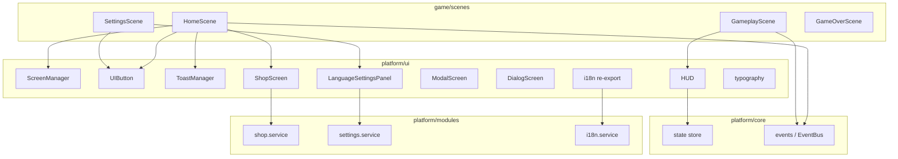

# UI Layer (`src/platform/ui`)

`src/platform/ui` là tầng **giao diện Phaser (UI Layer)** — tập hợp các UI component dùng chung, tách khỏi gameplay logic và business modules.

Game scenes nên import từ layer này thay vì tự render UI hoặc gọi trực tiếp vào modules.

---

# Tổng quan cấu trúc

```text
src/platform/ui/
├── index.ts              # Barrel export
├── types.ts              # Interface UI chung
├── typography.ts         # Font constants
├── i18n.ts               # Re-export t() cho game layer
├── screen/               # Quản lý màn hình overlay
├── button/               # Button component
├── toast/                # Thông báo ngắn
├── hud/                  # HUD trong gameplay
├── shop/                 # Màn hình cửa hàng
├── modal/                # Modal đơn giản
├── dialog/               # Dialog xác nhận
├── popup/                # Popup tùy biến
└── settings/             # Panel chọn ngôn ngữ
```

---

# `index.ts`

Re-export toàn bộ public API của UI layer.

Đây là điểm import chuẩn cho game scenes.

Ví dụ:

```ts
import { HUD, toast, screenManager } from '@platform/ui'
```

---

# `types.ts` — Contract UI

Định nghĩa interface chung cho toàn bộ hệ thống UI.

## Types

| Type           | Vai trò                 |
| -------------- | ----------------------- |
| `UIScreenId`   | ID màn hình overlay     |
| `IUIComponent` | Interface cơ bản        |
| `IUIScreen`    | Mở rộng từ UI component |
| `ToastOptions` | Cấu hình toast          |
| `UIToastType`  | Kiểu toast              |

---

## `IUIComponent`

Interface cơ bản:

```ts
show()
hide()
destroy()
isVisible()
```

---

## `IUIScreen`

Mở rộng thêm:

```ts
open()
close()
```

---

## `ToastOptions`

Cấu hình:

```ts
message
duration
type
```

---

## `UIToastType`

```ts
'info'
'error'
'success'
'warning'
```

---

# `typography.ts` — Font

Quản lý font dùng chung cho toàn bộ UI.

## Constants

| Constant       | Vai trò    |
| -------------- | ---------- |
| `FREDOKA_FONT` | Font chính |
| `NUNITO_FONT`  | Font phụ   |

---

## Quy ước sử dụng

### `FREDOKA_FONT`

Dùng cho:

* tiêu đề
* button
* text nổi bật

---

### `NUNITO_FONT`

Font phụ cho body text — đã export và preload cùng Fredoka, nhưng **các UI component hiện tại chủ yếu dùng `FREDOKA_FONT`**.

---

## Loading

Font được:

```text
Google Fonts
↓
index.html
↓
GameEngine preload
↓
Phaser init
```

---

# `i18n.ts` — Cầu nối i18n cho Game

Re-export:

```ts
t
i18n
```

từ:

```text
@platform/modules/i18n
```

---

## Quy tắc thiết kế

Game nên dùng:

```ts
@platform/ui/i18n
```

Không import trực tiếp:

```ts
@platform/modules
```

Mục tiêu:

```text
Giữ ranh giới layer rõ ràng
```

---

# `screen/` — Quản lý màn hình Overlay

Hệ thống navigation cho UI overlay.

## Files

| File               | Vai trò      |
| ------------------ | ------------ |
| `ScreenManager.ts` | Screen stack |

---

## Thành phần

### `BaseScreen`

Abstract class kế thừa:

```ts
Phaser.GameObjects.Container
```

### Đặc điểm

```text
Depth = 1000
Ẩn mặc định
```

---

### Helpers

```ts
createOverlay()
createButton()
```

---

### Lifecycle

```ts
open()
close()
show()
hide()
```

---

## `ScreenManager`

Navigation dạng stack.

### API

```ts
register()
unregisterForScene()

open()
close()

replace()

getActive()
```

---

## Luồng hoạt động

```text
open()
↓
ẩn screen hiện tại
↓
hiện screen mới
```

```text
close()
↓
restore screen trước đó
```

---

## Ví dụ

Dùng trong:

* `HomeScene`
* Shop
* Modal
* Popup

---

# `button/` — Button Component

Button dùng chung cho toàn game.

## Files

| File          | Vai trò |
| ------------- | ------- |
| `UIButton.ts` | Factory |

---

## API

```ts
createUIButton()
```

---

## Variants

### `primary`

```text
rectangle
+
stroke
+
text container
```

---

### `rounded`

```text
rounded rect
+
graphics
```

---

## Được dùng trong

* `HomeScene`
* `GameOverScene`
* `SettingsScene`
* `BaseScreen`

---

# `toast/` — Thông báo ngắn

Hiển thị notification ngắn trong game.

## Files

| File              | Vai trò     |
| ----------------- | ----------- |
| `ToastManager.ts` | Queue toast |

---

## Chức năng

* Queue nhiều toast
* Hiển thị tuần tự
* Gắn vào scene đang active

---

## Khởi tạo

Từ:

```text
GameEngine.bootstrap()
```

với:

```text
Phaser instance
```

---

## Màu theo loại

| Type    | Màu     |
| ------- | ------- |
| info    | xanh    |
| success | xanh lá |
| error   | đỏ      |
| warning | cam     |

---

## Animation

```text
fade in
↓
hiển thị
↓
fade out
```

---

## API

```ts
toast.show({
 message,
 type
})
```

---

# `hud/` — Gameplay HUD

Overlay hiển thị thông tin gameplay.

## Files

| File     | Vai trò      |
| -------- | ------------ |
| `HUD.ts` | Gameplay HUD |

---

## Hiển thị

* coins
* score

---

## Camera

```ts
setScrollFactor(0)
```

HUD luôn cố định.

---

## Đồng bộ state

Subscribe:

```ts
usePlatformStore
```

Tự động cập nhật:

* coins

---

## API

```ts
setScore()
```

Cập nhật realtime.

---

## Dùng trong

```text
GameplayScene
```

---

# `shop/` — Màn hình cửa hàng

Full-screen overlay cho shop.

## Files

| File            | Vai trò |
| --------------- | ------- |
| `ShopScreen.ts` | Shop UI |

---

## Đặc điểm

Kế thừa:

```ts
BaseScreen
```

ID:

```text
shop
```

---

## Chức năng

Render:

```ts
shop.getItems()
```

---

Thao tác:

```ts
shop.purchase()
restore()
```

---

Feedback:

```text
toast
```

---

Text:

```ts
t('shop.*')
```

---

Đăng ký với:

```ts
screenManager
```

trong `HomeScene`.

---

# `modal/` — Modal đơn giản

Modal một hành động.

## Files

| File             | Vai trò |
| ---------------- | ------- |
| `ModalScreen.ts` | Modal   |

---

## Chức năng

Hiển thị:

```ts
data.message
```

Tuỳ chọn:

```ts
data.onClose
```

---

Dùng cho:

```text
Thông báo một nút OK
```

---

# `dialog/` — Dialog xác nhận

Dialog nhiều hành động.

## Files

| File              | Vai trò        |
| ----------------- | -------------- |
| `DialogScreen.ts` | Confirm dialog |

---

## Nội dung

* title
* message
* nhiều buttons

---

## Tuỳ biến

```ts
DialogButton[]
```

---

## Helper

```ts
dialog.confirm(
 scene,
 title,
 message,
 onConfirm,
 onCancel?
)
```

Sinh nhanh:

```text
Cancel / OK
```

> Chưa được wire trong game scenes mẫu; dùng khi cần confirm flow.

---

# `popup/` — Popup tùy biến

Popup linh hoạt cho UI đặc biệt.

## Files

| File             | Vai trò |
| ---------------- | ------- |
| `PopupScreen.ts` | Popup   |

---

## API

```ts
createPopup(
 scene,
 id,
 buildContent
)
```

---

Ưu điểm:

```text
Custom UI linh hoạt hơn Modal/Dialog
```

> Chưa được wire trong game scenes mẫu; dùng khi cần overlay tuỳ biến.

---

# `settings/` — Panel cài đặt

UI quản lý ngôn ngữ.

## Files

| File                       | Vai trò        |
| -------------------------- | -------------- |
| `LanguageSettingsPanel.ts` | Language panel |

---

## Chức năng

Hỗ trợ:

```text
en
vi
```

---

Hiển thị:

```text
✓ ngôn ngữ hiện tại
```

---

Luồng thay đổi

```text
click
↓
settings.setLanguage()
↓
toast
↓
scene.restart()
↓
refresh text
```

---

## Dùng trong

```text
SettingsScene
```

---

# Quan hệ giữa các layer



---

# So sánh các layer

| Layer         | Vai trò                                 |
| ------------- | --------------------------------------- |
| `core`        | State, events, storage — không có UI    |
| `modules`     | Business logic                          |
| `ui`          | Render UI, gọi modules, subscribe state |
| `game/scenes` | Gameplay + compose UI                   |

---

# Quy tắc Import cho Game

Sử dụng:

```ts
@platform/ui
```

để import UI.

---

Dịch text:

```ts
@platform/ui/i18n
```

Không dùng:

```ts
@platform/modules
```

---

Gameplay event:

```ts
@platform/core/events
```

---

Tránh import:

* `bootstrap/App`
* service nội bộ modules (trừ khi thật sự cần)

Mục tiêu:

```text
UI độc lập
+
gameplay tách biệt
+
dễ mở rộng
```
